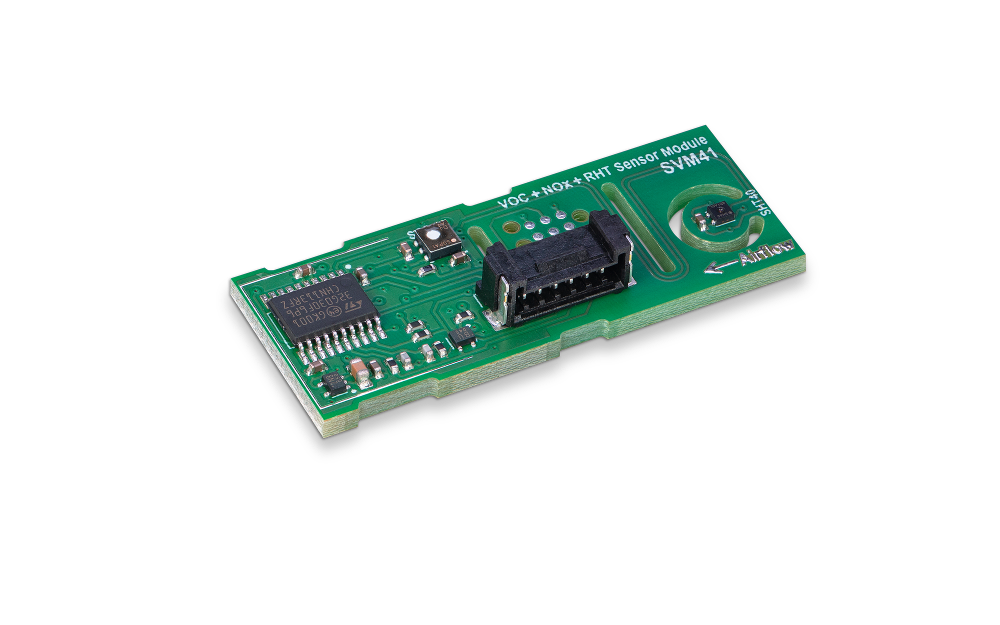
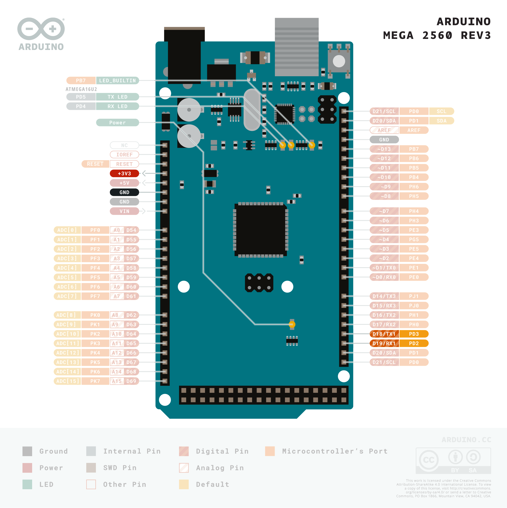
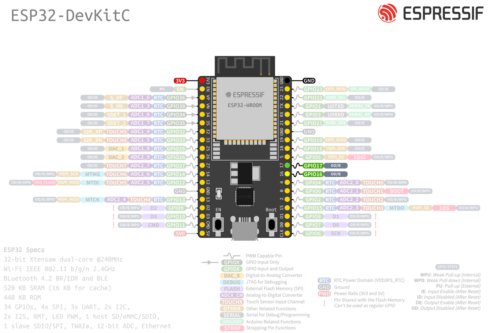

# Sensirion UART SVM4x Arduino Library

This is the Sensirion SVM4x library for Arduino using the
modules UART interface.



Click [here](https://sensirion.com/my-sgp-ek) to learn more about the SVM4x 
Evaluation Kit Board.
The SVM4x evaluation kit covers evaluation of the SGP40 and SGP41 sensors.


## Installation of the library

This library can be installed using the Arduino Library manager:
Start the [Arduino IDE](http://www.arduino.cc/en/main/software) and open
the Library Manager via

`Sketch` ➔ `Include Library` ➔ `Manage Libraries...`

Search for the `Sensririon UART Svm4x` library in the `Filter your search...` 
field and install it by clicking the `install` button.

If you cannot find it in the library manager, download the latest release as .zip file 
and add it to your [Arduino IDE](http://www.arduino.cc/en/main/software) via

`Sketch` ➔ `Include Library` ➔ `Add .ZIP Library...`

Don't forget to **install the dependencies** listed below the same way via library 
manager or `Add .ZIP Library`


## Dependencies
* [Sensirion Core](https://github.com/Sensirion/arduino-core)

## Sensor wiring

Use the following pin description to connect your SVM4x to your Arduino board:


| *Pin* | *Cable Color* | *Name* | *Description*                                           | *Comments*                                   |
|-------|---------------|:------:|---------------------------------------------------------|----------------------------------------------|
| 1     | red           |  VDD   | Supply Voltage                                          | 3.3 or 5V                                    |
| 2     | black         |  GND   | Ground                                                  |                                              |
| 3     | green         |   RX   | UART: Transmission pin for communication, connect to TX |                                              |
| 4     | yellow        |   TX   | UART: Receiving pin for communication, connect to RX    |                                              |
| 5     | blue          |  SEL   | Interface select                                        | Leave floating or pull to VDD to select UART |
| 6     | purple        |   NC   | Do not connect                                          |                                              |

### Board-specific wiring

We recommend using Arduino Boards or an ESP supporting **two or more hardware serial connections** to run the example code. One serial port is needed to connect the SVM4x evaluation kit and the other one (over USB) for logging to the Serial Monitor of the Arduino IDE.

Arduino Uno, Micro and Nano have only one hardware serial connection and are therefore not recommended to use. There is the option to use the SoftwareSerial library to emulate a serial connection, but it does not work reliably to communicate with the sensor at the required baudrate of 115200 baud.

You will find pinout schematics for recommended board models below:

<details><summary>Arduino Mega 2560 Rev3 Pinout</summary>
<p>
This arduino board supports 4 hardware serial connections, 
and the connection to your PC over the USB Cable will use one of them (Serial Port 0).    

The following wiring will connect the SVM4x to **Serial Port 1**. 

| *SVM4x* | *SVM4x Pin* | *Cable Color* | *Board Pin* |
| :---: | --- | --- | --- |
| VDD | 1 | red | +3.3V |
| GND | 2 | black | GND |
| RX  | 3 | green | D18 (TX1) |
| TX  | 4 | yellow | D19 (RX1) |
| SEL | 5 | blue | Do not connect |
| NC  | 6 | purple | Do not connect |

> **Note:** Make sure to connect serial pins as cross-over (RX pin of sensor -> TX on Arduino; TX pin of sensor -> RX pin of Ardunio)


</p>
</details>

<details><summary>Espressif ESP32 DevKitC Pinout</summary>
<p>
This board supports 4 hardware serial ports, and the USB connection to your PC uses one of them (Serial Port 0).

The following wiring will connect the sensor to **Serial Port 2**.
>**Note:** that Serial Port 1 uses by default pins shared with the Flash Memory and thus cannot be used without special configuration.

| *SVM4x* | *SVM4x Pin* | *Cable Color* | *Board Pin* |
| :---: | --- | --- | --- |
| VDD | 1 | red | 3.3V |
| GND | 2 | black | GND |
| RX  | 3 | green | GPIO17 (TXD 2)  |
| TX  | 4 | yellow | GPIO16 (RXD 2) |
| SEL | 5 | blue | Do not connect |
| NC  | 6 | purple | Do not connect |

> **Note:** Make sure to connect serial pins as cross-over (RX pin of sensor -> TX on Arduino; TX pin of sensor -> RX pin of Ardunio)




</p>
</details>


## Quick start example

1. Install the libraries and dependencies according to [Installation of the library](#installation-of-the-library)

2. Connect the SVM4x evaluation kit as explained in [Sensor wiring](#sensor-wiring)

3. Load the `exampleUsage` sample project:

`File` ➔ `Examples` ➔ `Sensirion UART SVM4x` ➔ `exampleUsage`

4. Depending on your Arduino board you may need to adapt code sample. 
See the [board specific instruction](#board-specific-instructions) section for more information. 

1. Make sure to select the correct board model under `Tools` ➔ `Boards` and the 
   connected USB port under `Tools` ➔ `Port`.

2. Click the `Upload` button in the Arduino IDE or `Sketch` ➔ `Upload`

3. When the upload process has finished, open the `Serial Monitor` or `Serial
   Plotter` via the `Tools` menu to observe the measurement values. Note that
   the `Baud Rate` in the used tool has to be set to `115200 baud`.

### Board-specific instructions
<details><summary>Arduino Mega 2560</summary>
<p>

#### Serial Interface
The provided wiring helped you to connect the SVM4x to **Serial Port 1**. 
Therefore, the following line needs to be used in the usage example code:

`#define SENSOR_SERIAL_INTERFACE Serial1`
</p>
</details>


<details><summary>ESP32 DevKitC</summary>
<p>

#### ESP32 Library
The ESP32 board is not supported by default with Arduino IDE. If it is your first time using an ESP32 board, you should follow this [guide](https://docs.espressif.com/projects/arduino-esp32/en/latest/installing.html) from Esspressif itself.

#### Serial Interface
The provided wiring helped you to connect the sensor to **Serial Port 2**.

Since ESP boards require `HardwareSerial` implementation, you need to include the following lines in the usage example code:

```
#include <HardwareSerial.h>
HardwareSerial HwSerial(2);
#define SENSOR_SERIAL_INTERFACE HwSerial
```
</p>
</details>


# Contributing

**Contributions are welcome!**

We develop and test this driver using our company internal tools (version
control, continuous integration, code review etc.) and automatically
synchronize the master branch with GitHub. But this doesn't mean that we don't
respond to issues or don't accept pull requests on GitHub. In fact, you're very
welcome to open issues or create pull requests :)

This Sensirion library uses
[`clang-format`](https://releases.llvm.org/download.html) to standardize the
formatting of all our `.cpp` and `.h` files. Make sure your contributions are
formatted accordingly:

The `-i` flag will apply the format changes to the files listed.

```bash
clang-format -i src/*.cpp src/*.h
```

Note that differences from this formatting will result in a failed build until
they are fixed.

# License

See [LICENSE](LICENSE).
